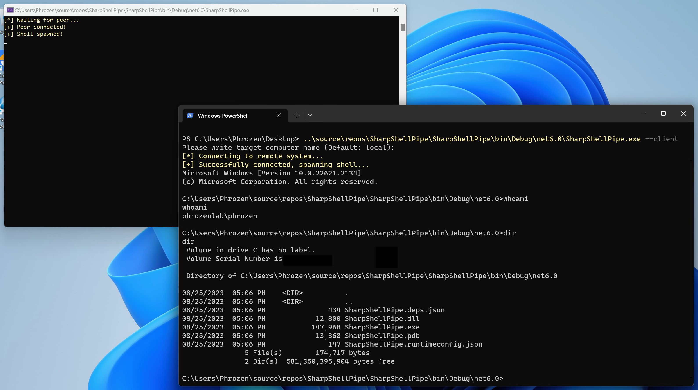

# SharpShellPipe

## Project Description

This lightweight C# application serves as a demonstration of how simple it is to interactively access a remote system's shell via named pipes using the SMB protocol. It includes an optional encryption layer leveraging AES GCM, utilizing a shared passphrase between both the server and the client. If you're interested in an example that employs both AES GCM and RSA for additional security, consider checking out another one of my projects, [SharpFtpC2](https://github.com/DarkCoderSc/SharpFtpC2). Implementing that security layer into this project would also be relatively straightforward.

Exercise caution if you decide to use this project in a production environment; it was not designed for such use. Proceed at your own risk. The primary aim of this project is to illustrate a well-known network evasion detection technique that will soon be featured on the [Unprotect Project](https://unprotect.it/) website.

## Usage

### Server

`SharpShellPipe.exe`

This is the computer you wish to access to.

### Client

`SharpShellPipe.exe --client`

You will be prompted to enter the name of the computer you wish to connect to the one hosting the **SharpShellPipe** Server. To connect to the local machine, you can either enter `.` or simply press the Enter key.
